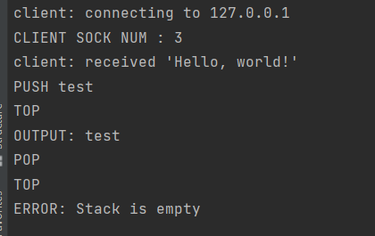

# ProcessSync

ID: 209011840 ID: 206795841

This project represent a shared Stack using multi-Process system
over Server/Client .

Here is the instruction of how to use:

- Before you start

    make all
    ./server
    ./client localhost

The main goal is to implementing stack server over multi 
process using shared memory and locking routines.

### Stack

PUSH will push <text> into the stack.

POP will pop text from the stack.

TOP will display (output) the stack top.

EXIT kill this dialog with the server.

###mmap
We allocate the shared memory for all processes in stack "stack_Init" method using mmap of
(10 * sizeof(node) ) bytes long . 

###Locks and Synchronization
Our stack is safe for multi client connection, by using looking of file descriptor (fcntl).

### Server
Server, run several tests to check allocation and server-stack communication.
open socket and listen for clients (multi-process)
The server handles the client request for a stack .

### client
Client, send commands to the server to manipulate the server stack .

### Test
Test methods such as allocation correctness, manipulations on shared stack (push, pop, top).

    
    ./Test localhost

### Malloc/Free
- Malloc, malloc func allocate memory on the shard memory and moving the pointer to the next block.
- Free, free func is simply updating our memory management structure, to free the used blocks.

### how to use :
- Open terminal for the server and run it with ./server.
- Open few more terminals for client ./client localhost.
- in the client terminal write the command in uppercase and wait for the server response.
- 

 
